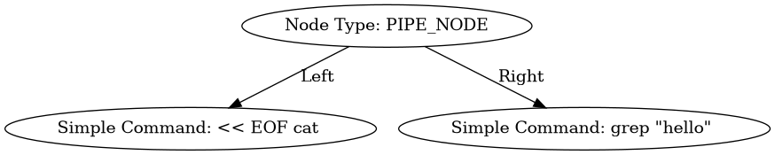
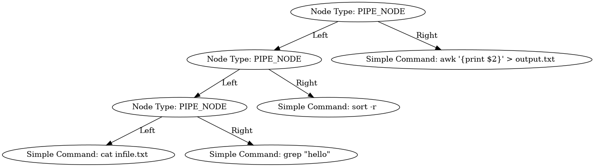

# Minishell

In this project, we aim to create a custom shell, akin to the Bourne Again Shell (bash). The key capabilities required for this Minishell include:

---

### Lessons Learned

- **#1 Do not underestimate this project** — as we delve deeper, it becomes challenging.
- Collaboration
- Project management by dividing the project into manageable parts
- Git operation, working on branches and safeguarding our master branch.
- GitHub and leveraging its functionalities: issues tracking, detailed documentation and review of pull requests, and GitHub actions (later on the project).

### Reflection for future projects

- **Keep it simple.** There will instances that you will pursue a rabbit hole. Personally, I have reservations about the vagueness of project subjects (as someone coming from science where specificity is important).
- **GitHub Integration.** We should have use GitHub from the very beginning. We initially did the project with the git repository from school and we were not able to manage merging both of our works. We did not figure out creating a pull-request from CLI and compare the edited files.
- **Share utilities and basic functions.** We should have kept the utility functions in the master branch for seamless collaboration. We initially divided the project as Lexer-Parsing and Execution. What happened in the project was we have similar (removed others for redundancy) and slightly similar functions (differs in parameters) that functions for the same goal.
- **Make use of GitHub actions.** Implement GitHub actions early in the project. You can set these checks for the master or pull-request.
    - keep track that the master would always be compilable. We have issues with the readline library of macos-11, so we have our compilation check ran in `ubuntu-latest`.
    - add an action to check for `norminette` errors (we will have this one later on as we have coded not accordingly to norm)
    - we created our own testers for almost every part of the project (lexer, parsing, expansion, builtins, basic execution, etc) — we should have made those testers and ran as a GitHub action. What happened later on the project as we are debugging for specific functionalities and leaks, we lose some of the other functionalities. By keeping track of what is already working, it is easily to distinguish how the new code is incompatible or need fixing.

---

### Required capabilities

- **Working History:** Implement a functional command history.
- **Quotes Handling:** Manage both single (`‘ ’`) and double quotes (`“ ”`).
- **Redirections:** Support file input/output redirections (`<`, `>`, `<<`, `>>`).
- **Pipes:** Enable the use of pipes (`|`) for command chaining.
- **Environment Variables:** Include functionality for handling environment variables.
- **Exit Status:** Check and display the exit status of the last command using `$?`.
- **Signal Handling:** Mimic bash behavior for signals. In interactive mode:
    - Ctrl-C: displays a new prompt on a new line
    - Ctrl-D: exits the shell
    - Ctrl-\\: does nothing
- **Builtins:** Implement a set of built-in commands.
    - **`echo`** with the **`n`** option.
    - **`cd`** accepting only relative or absolute paths.
    - **`pwd`** (no options) - to display the current working directory.
    - **`export`** (no options) - to set environment variables.
    - **`unset`** (no options) - to remove environment variables.
    - **`env`** (no options) - to display the current environment.
    - **`exit`** (no options) - to terminate the shell.

### General loop of a shell

The shell's fundamental logic consists of three steps:

1. **Read:**
    - Utilize the `readline()` function to read commands from the standard input.
2. **Parse:**
    - Separate (tokenization) the input command string into a program and its arguments.
3. **Execute:**
    - Run the parsed command, executing the specified program with the provided arguments.

## Tokenization / Lexical Analysis

Tokenization is the first step in parsing a command string, involves dividing the command string into tokens and categorizing their appropriate type. The key aspects of the tokenization process are:

- Store the identified tokens in a linked list for efficient organization and retrieval.
- Iterate through the command string by token
- Whitespaces are skipped during the process
- Assign the appropriate token type for each token in the command string
- Once the entire command string is processed, we append an end token identifier `TK_EOF` to easily iterate through the token list.

> We started the project of doing the bonus so we initially processed tokens required for bonus: `&&`, `||`, `( )`, and `;`.  We also have initially included those tokens in our grammar and syntax checks. However, this project became more challenging for us as we progress deeper to the project and we ultimately decided to drop the bonus and focus on fulfilling the mandatory part of the subject.
> 

## Syntax

After the tokenization process, we check for acceptable token combinations or syntax based on our grammar. We based our grammar from bash but limited on fulfilling the mandatory part of the subject.

### **Token Types**

The tokens are categorized into distinct types, each represented by the `t_tk_kind` enumeration:

```c
typedef enum e_tk_kind
{
    TK_WORD,         // Represents a general word in the command.
    TK_PIPE,         // Indicates the presence of a pipe (|) in the command.
    TK_OPERATOR,     // Denotes "\n"
    TK_REDIRECT,     // Indicates a redirection operator (<, >, <<, >>).
    TK_EOF           // Signifies the end of the command string with a NULL word.
} t_tk_kind;
```

### Our Grammar

An overview of the expected sequence of tokens in a valid syntax. The grammar is important as it would be the basis on how you parse the command string. This grammar is in Backus-Naur Form.

Basics:

- **left-hand** - represented by a **non-terminal symbol**
    - a non terminal symbols are placeholders for patterns that can be further expand or replaced by other symbol
- **::=** - defined as
- **unqouted |** - or
- **right-hand** - sequence of symbols that can replace the non-terminal

```
pipeline                ::= command
                         |   pipeline "|" command
        
command                 ::= word
                         |   redirection
                         |   command word
                         |   quoted_command

redirection             ::= redirectionop filename

redirectionop           ::= "<"  |  ">"  |  "<<" | ">>"

quoted_command          ::= single_quoted_sequence
                         |   double_quoted_sequence

single_quoted_sequence  ::= "'" word "'"
double_quoted_sequence  ::= '"' word '"'

parenthesized_command   ::= "(" list ")
```

### Abstract Syntax Tree (AST)

The Abstract Syntax Tree (AST) serves as hierarchical and structured representation of the parsed code. This enables adding logic and comprehension of the tokens extracted from the command string input. This facilitates the seamless execution of commands.

> In simple words, AST is making sense out of the tokens that we have
> 

Since we are only focusing on the mandatory part , we did not deal on command list, logical operators and semicolon. **The root node of our tree is always a pipe.** If there is no pipe in the command string then there is no tree but only a single node. 

It is important to refer back to the grammar as it is the basis of what consists a valid non-terminal symbol. In short, a valid syntax.

- **A pipeline**
    - is either a command (referred to as a "simple command" henceforth)
    - or a pipeline pipe (`|`)  to a simple command, and vice versa
- **A  simple command**
    - a single word
    - may comprise multiple words
    - a redirection
    - a combination of word and redirection
    - a word can be quoted - enclosed with (`” “`) or (`’ ‘`)
    

The general process in building the AST. 

- process is always left to right since we build our tokens iterating from left to right and with a linked list.
- Initial step involves parsing the pipeline.
- The first simple command is parsed, resulting in the creation of a `SIMPLE_CMD` node.
- If a pipe token `TK_PIPE` is encountered,  a `PIPE` node is created.
- The previously parsed `SIMPLE_CMD` node ais the designated as the left node of the newly created `PIPE` node.
- Parse the rest. If it is a simple command then another `SIMPLE_CMD` node as right node of the `PIPE` node
- In cases where an additional `PIPE` node is encountered, the entire preceding tree is transposed to the left node of the the new `PIPE` node

**Example 1** 
For the command `<< EOF cat | grep "hello"`. It will be tokenized and parsed as below.
```
LexParser_Test> << EOF cat | grep "hello"
Token 0
Token: 	<<
Type: 	TK_REDIRECT

Token 1
Token: 	EOF
Type: 	TK_WORD

Token 2
Token: 	cat
Type: 	TK_WORD

Token 3
Token: 	|
Type: 	TK_PIPE

Token 4
Token: 	grep
Type: 	TK_WORD

Token 5
Token: 	"hello"
Type: 	TK_WORD

Token 6
Type: 	TK_EOF

LexParser_Test> 
```



**Example 2**
For command `cat file.txt | grep "keyword" | sort -r | awk '{print $2}' > output.txt
`. It has multiple pipes and a redirection
```
LexParser_Test> cat infile.txt | grep "hello" | sort -r | awk '{print $2}' > output.txt
Token 0
Token:  cat
Type:   TK_WORD

Token 1
Token:  infile.txt
Type:   TK_WORD

Token 2
Token:  |
Type:   TK_PIPE

Token 3
Token:  grep
Type:   TK_WORD

Token 4
Token:  "hello"
Type:   TK_WORD

Token 5
Token:  |
Type:   TK_PIPE

Token 6
Token:  sort
Type:   TK_WORD

Token 7
Token:  -r
Type:   TK_WORD

Token 8
Token:  |
Type:   TK_PIPE

Token 9
Token:  awk
Type:   TK_WORD

Token 10
Token:  '{print $2}'
Type:   TK_WORD

Token 11
Token:  >
Type:   TK_REDIRECT

Token 12
Token:  output.txt
Type:   TK_WORD

Token 13
Type:   TK_EOF

LexParser_Test> 
```


Here are our functions to produce the `.dot` files for creating the graph and with `graphviz` you can convert it an image on the command line

```
void	print_ast_dot(t_node *node, FILE *output);

void	create_dotfile(t_node *ast, int cmd_index)
{
	FILE	*dotFile;
	char	filename[50];

	snprintf(filename, sizeof(filename), "./dotfiles/ast_%d.dot", cmd_index);
	dotFile = fopen(filename, "w");
	if (dotFile == NULL)
	{
		printf("Error: cannot create dot file\n");
		return ;
	}
	fprintf(dotFile, "digraph AST {\n");
	print_ast_dot(ast, dotFile);
	fprintf(dotFile, "}\n");
	fclose(dotFile);
}

void print_ast_dot(t_node *node, FILE *output)
{
	if (node == NULL)
		return ;
	fprintf(output, "  node%p [label=\"", (void *)node);
	if (node->type == SIMPLE_CMD)
	{
		fprintf(output, "Simple Command: ");
		for (char **arg = node->content.simple_cmd.argv; *arg != NULL; ++arg)
			fprintf(output, "%s ", *arg);
	}
	else
		fprintf(output, "Node Type: %s", node_type_strings[node->type]);
	fprintf(output, "\"];\n");
	if (node->type != SIMPLE_CMD)
	{
		if (node->content.child.left)
		{
			print_ast_dot(node->content.child.left, output);
			fprintf(output, "  node%p -> node%p [label=\"Left\"];\n", (void *)node, (void *)(node->content.child.left));
		}
		if (node->content.child.right)
		{
			print_ast_dot(node->content.child.right, output);
			fprintf(output, "  node%p -> node%p [label=\"Right\"];\n", (void *)node, (void *)(node->content.child.right));
		}
	}
}
```
Then install `graphviz` if you need to.
```
sudo apt-get install graphviz 
dot -Tpng {filename.dot} -o {output.png} //to convert to .png
```

##Expansion
